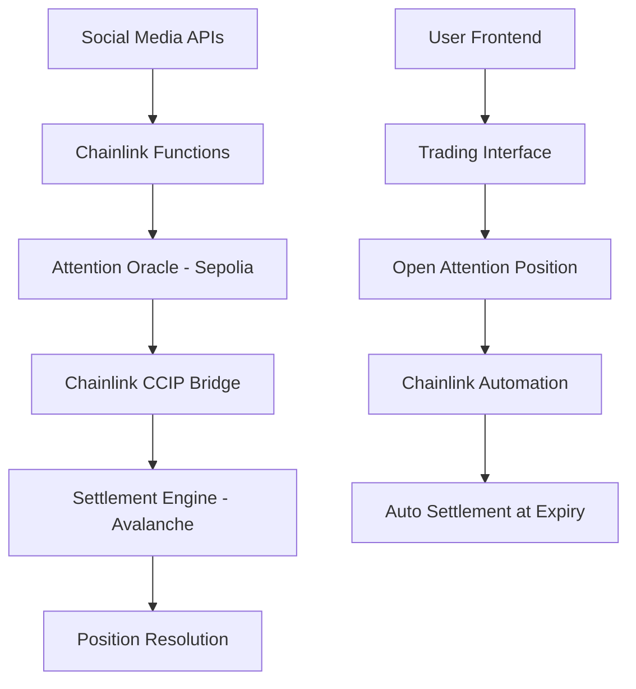

# 🧠 Chainly - Attention Derivatives Platform

**Tagline:** *Attention Is Alpha* 

The world's first attention derivatives platform. Trade social media buzz and viral trends before price moves.

## 🎯 Project Description

Chainly revolutionizes trading by creating an entirely new asset class - **attention derivatives**. Instead of trading token prices, users speculate on social media attention, viral trends, and digital buzz across Twitter, Reddit, Farcaster, and more.

### Key Features:
- 📊 **Attention Futures** - 24h, 48h, 7d contracts on social buzz
- ⚡ **Leveraged Attention Tokens** - 3x exposure like PEPE3XATTN  
- 🔄 **Cross-Chain Trading** - Ethereum ↔ Avalanche via Chainlink CCIP
- 🤖 **Automated Settlement** - Chainlink Automation settles based on real data
- 📈 **Viral Trend Prediction** - AI-powered analysis of meme coin momentum

### Why Trade Attention?
**Attention precedes price.** When PEPE starts trending on Twitter, smart traders profit from the attention surge before retail FOMO drives price up 300%.

## 🚀 How to Run

### Prerequisites
```bash
node >= 18.0.0
npm or yarn
MetaMask wallet
```

### Installation
```bash
# Clone the repository
git clone https://github.com/0xTaneja/ChainLink-Hack.git
cd ChainLink-Hack

# Install dependencies
npm install

# Install frontend dependencies
cd frontend
npm install

# Start the development server
npm run dev
```

### Environment Setup
Create `.env` file in the root directory:
```bash
# Copy from frontend/env file
PRIVATE_KEY=your_private_key
NEXT_PUBLIC_SEPOLIA_RPC=https://ethereum-sepolia-rpc.publicnode.com
NEXT_PUBLIC_FUJI_RPC=https://avalanche-fuji-c-chain-rpc.publicnode.com
NEXT_PUBLIC_WALLETCONNECT_PROJECT_ID=your_project_id
```

### Access the Application
- Frontend: `http://localhost:3000`
- Trading Interface: Navigate to "Markets" → Select Token → "Trade"

## 🔄 Project Flow



### Flow Description:
1. **Data Collection**: Chainlink Functions fetch real-time social media data
2. **Oracle Updates**: Attention scores calculated and stored on Sepolia
3. **Cross-Chain Bridge**: CCIP sends attention data to Avalanche for settlement
4. **Trading**: Users open long/short positions on attention futures on sepolia as well as fuji.
5. **Settlement**: Chainlink Automation settles contracts based on actual attention metrics

## 📍 Deployed Addresses

### Ethereum Sepolia
- **Attention Oracle**: `0x92f80D474689e42F120445E8Fe45F47B614582DB`
- **Futures Contract**: `0xCf0e37eF2990018df9Bb81b11051672340E793d3`
- **CCIP Sender**: `0x7D3bA4A6cF25D6Aeb63C8A65E9e7162E98A7A414`

### Avalanche Fuji
- **Settlement Engine**: `0x5908e961D998fe2B6c0Ed872eFa95eB248fADC33`
- **CCIP Receiver**: `0xCFF01e60C769C5Fde8E488E7bE55fBb8D907AFf3`
- **Circuit Breaker**: `0x1d9553548F0950ae9c959c16eb11f477ce485888`

### Data References
- **ETH Attention Feed**: `0xfC67602bFB25484649af2F0d01F45400F6bfA762`
- **PEPE Attention Feed**: `0x28E064279BdC4c879a4d70F438779Ea40Ce0E9f0`
- **DOGE Attention Feed**: `0x1796E366b7f1951949566bE74Ad259104e0e865f`

### ChainLink Details
- **ChainLink Subscription ID** - `5123`
- **ChainLink Automation Link** - `0xA2b0783323CA86211ef870487Fc9D6E8565975B4`
- **ChainLink Automation Doge** - `0x1796E366b7f1951949566bE74Ad259104e0e865f`
- **ChainLink Automation Pepe** - `0x28E064279BdC4c879a4d70F438779Ea40Ce0E9f0`
- **ChainLink Automation ETH**  - `0xfC67602bFB25484649af2F0d01F45400F6bfA762`
- **ChainLink Automation BTC**  - `0x0cc63D70D029dc95ADB09199E5Cd702dbad2237D`
- **ChainLink CCIP** - `0x045c5a451c51c5cd3d5ad81f2ebe6848f8c87ffb`

## 🏆 Track Information

### Chainlink Services Used:
- ✅ **Functions**: Social media data fetching
- ✅ **Automation**: Contract settlement
- ✅ **CCIP**: Cross-chain messaging

### Why Multiple Tracks:
Chainly creates a **new asset class** (Onchain Finance), implements **cross-chain infrastructure** (CCIP), deploys on **Avalanche**, and builds up to a Attention Derivatives Platform.

## 🌟 Launching V1 Post Hackathon within 2 months !! 

**Join the attention revolution! Follow [@Chainly](https://twitter.com) for updates**

## 🗺️ Roadmap

### 🚀 **V2 - Social Expansion** (Q1 2025)
- **New Platforms**: TikTok, YouTube, GitHub integration
- **Advanced Analytics**: Sentiment analysis and trend scoring
- **Mobile Trading**: iOS/Android app launch
- **Liquidity Mining**: CHAINLY token rewards for traders

### 🌍 **V3 - Institutional Grade** (Q2 2025)
- Will be Planned after V2

### 🤖 **V4 - AI-Powered Future** (Q3 2025)
- Will be planned after v3

---

## 🛠️ Tech Stack

- **Frontend**: Next.js, React, TypeScript, Tailwind CSS
- **Smart Contracts**: Solidity, Hardhat, OpenZeppelin
- **Oracles**: Chainlink Functions, Automation, CCIP
- **Blockchains**: Ethereum Sepolia, Avalanche Fuji
- **APIs**: Twitter, Reddit, Farcaster, CryptoCompare

## 🤝 Contributing

Interested in contributing to the attention economy? Join our Discord and help build the future of social trading!

## 📄 License

MIT License - see [LICENSE](LICENSE) file for details.

---

**Built with ❤️ for the Chainlink Hackathon 2024**

*Chainly - Where Attention Becomes Alpha* 🧠💎